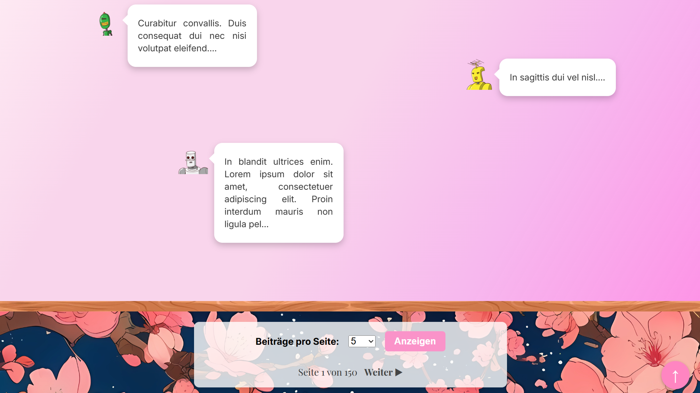

# Blog-Website

This project was developed as a personal web application to showcase a blog platform.  
It features a server-side rendered architecture using **Express.js** and **Pug**, with a TypeScript-based client-side implementation for interactivity.

## Features

- **Server-Side Rendering (SSR):** Dynamic pages rendered using Pug templates.  
- **User Authentication:** Session-based login system.  
- **Blog Management:** Create, edit, and view blog posts.  
- **Interactive UI:** Client-side scripts for enhanced user experience (e.g., image zoom, scroll-to-top).  
- **Responsive Design:** Optimized layouts for various devices.  

## Project Structure

- **Client:** TypeScript modules for client-side interactivity.  
- **Server:** Express.js server with modular routes, controllers, and middleware.  
- **Shared:** Common utilities, data models, and Pug templates for reuse across the application.  

### Key Directories
- `src/client`: Client-side scripts (e.g., `comments.ts`, `imageZoom.ts`).  
- `src/server`: Server-side logic, including routes, controllers, and database access.  
- `src/shared`: Shared resources like data models (`blogpost.ts`, `user.ts`) and Pug templates.  

## Usage

### Development

To start the development environment:

1. Install dependencies:
```sh
   npm install
```

2. Start the development server:
```sh
   npm run dev:server
```

3. Start the client build/watch process:
```sh
   npm run dev:client
```

4. Open your browser at:
   http://localhost:8080

## Gallery

  



## Download

A release package is available [here](https://github.com/lufa3014/Deferred-Rendering-Engine/releases/latest)
